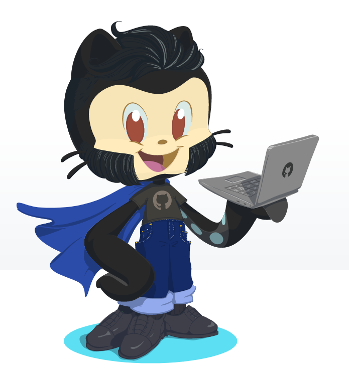

## <h2 align="center">Olá, eu sou o Jonathan! </h2>

  

  
  
  

##

### Sobre mim

 - 👨‍🎓 22 anos, Estudante de Engenharia de Software, Atualmente estou aberto para oportunidades de estágio. 

 - 💻 Tecnologias de Interesse: JavaScript, NodeJS, HTML, CSS, , React, React Native. 

 - 🎯 Campos de interesse: Os campos de interesse específicos incluem desenvolvimento web e mobile. 

  

## Conhecimentos nas seguintes tecnologias: :man_technologist:

    
    &nbsp;&nbsp;&nbsp;&nbsp;&nbsp;&nbsp;&nbsp;&nbsp;&nbsp;&nbsp;&nbsp;&nbsp;&nbsp;
    
    &nbsp;&nbsp;&nbsp;&nbsp;&nbsp;&nbsp;&nbsp;&nbsp;&nbsp;&nbsp;&nbsp;&nbsp;&nbsp;
    
    &nbsp;&nbsp;&nbsp;&nbsp;&nbsp;&nbsp;&nbsp;&nbsp;&nbsp;&nbsp;&nbsp;&nbsp;&nbsp;
    
    &nbsp;&nbsp;&nbsp;&nbsp;&nbsp;&nbsp;&nbsp;&nbsp;&nbsp;&nbsp;&nbsp;&nbsp;&nbsp;
    

## Contato :phone:

    
    &nbsp;&nbsp;&nbsp;&nbsp;&nbsp;&nbsp;&nbsp;&nbsp;&nbsp;
    
    &nbsp;&nbsp;&nbsp;&nbsp;&nbsp;&nbsp;&nbsp;&nbsp;&nbsp;
    

